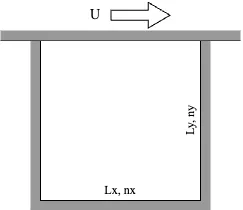

# 2d_cavity_flow_cpp

## 概要
c++を用いて、２次元キャビティ流れを計算するプログラムを作成する。

## 目的
- c++の勉強のため
  - c++の文法、環境に親しむ
  - c++独自のオブジェクト指向を学ぶ
  - pythonとの違い、利点欠点を学ぶ
- 入社前の暇つぶしのため
- 流体の勉強もできたらいいな(今後には活きなそうだが。)
- gitをしっかりと使う(戒め)

## To Do
- [x] mesh2dの作成: スタガードグリッドに対応した直交座標系を作成する
- [x] flow_fieldの作成: mesh2dからu, v, pを扱うクラスを作成する
- [x] flow_fieldを出力する仕組みを作る
- [ ] 空間差分Diffの作成: 1dの微分を使いまわせるようにしたい。よく使う微分項(d2udx2くらいまで)は保持するようにするか？

## 個人的コーディングルール(随時更新)
### Gitブランチ管理
- `main`: 安定版、本番コード
  - 常に動作する状態を維持する
  - 直接開発しない
- `dev`: 開発のベース
  - 機能開発を行うブランチのベース
  - `main`から派生し、機能開発が済んだら`main`へマージする
    - `main`へのマージの際に、コメント付きタグを貼る
  - 全ての`feature/*`ブランチをマージしてから`main`へマージする
- `feature/*`: 機能開発用
  - 各機能ごとに独立したブランチを作成する
  - `dev`から派生し、完成したら`dev`へマージする
- `hotfix/*`: バグ修正用
  - `main`でのバグを修正するためのブランチ
  - `main`から派生し、修正後`main`へマージする

ブランチ管理のイメージ図は以下である。  

### 命名規則
| 要素 | 規則 | 例 |
| --- | --- | --- |
| 変数名 | snake_case | my_name |
| 定数名 | SNAKE_CASE | MY_NAME |
| クラス名 | PascalCase | MyClass |
| 関数名　| snake_case | my_func |
| メソッド名 | snake_case | my_func |

## 参考にしたサイト
- [【オブジェクト指向C++】2次元ナビエストークス方程式(キャビティ流れ)の数値計算](https://takun-physics.net/14538/)