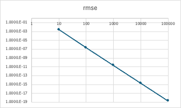

# 差分スキームについて

## 2次中心差分

### 一階微分
$
f(x+dx) = f(x) + \partial_x f(x) dx + \frac{1}{2} \partial_{xx} f(x) dx^2 + O(dx^3) \\
f(x-dx) = f(x) - \partial_x f(x) dx + \frac{1}{2} \partial_{xx} f(x) dx^2 + O(dx^3)
$
より、
$$
f(x+dx) - f(x-dx) = 2 \partial_x f(x) dx \\
\therefore  \frac{\partial f(x)}{\partial x} = \frac{f(x+dx) - f(x-dx)}{2dx} + O(dx^2)
$$
と、二次精度で計算できる。

境界条件を考えて離散化すると以下のようになる。(端点では2次前進/後退差分を用いている)  
$0 \leq i \leq nx$の範囲を前提にする。  
1. $1 \leq i \leq nx-1$:
$
\left( \frac{\partial f}{\partial x} \right)_i = \frac{f_{i+1}-f_{i-1}}{x_{i+1}-x_{i-1}}
$
2. $i = 0$: 
$
\left( \frac{\partial f}{\partial x} \right)_0 = \frac{-3f_{0}+4f_{1}-f_{2}}{x_{2}-x_{0}}
$
3. $i = nx$: 
$
\left( \frac{\partial f}{\partial x} \right)_{nx} = \frac{3f_{nx}-4f_{nx-1}+f_{nx-2}}{x_{nx}-x_{nx-2}}
$

### 計算結果
$y = sin(x)$ を中心差分した結果と $cos(x)$ とのMSEをプロットした図(図ではrmseとなっているが間違い)。横軸が格子数、縦軸がMSE。  
  
格子数が10倍(=dxが0.1倍)になると、MSEが1e-4倍(=RMSEだと0.01倍)になっている。
二次精度が出ていることがわかる。