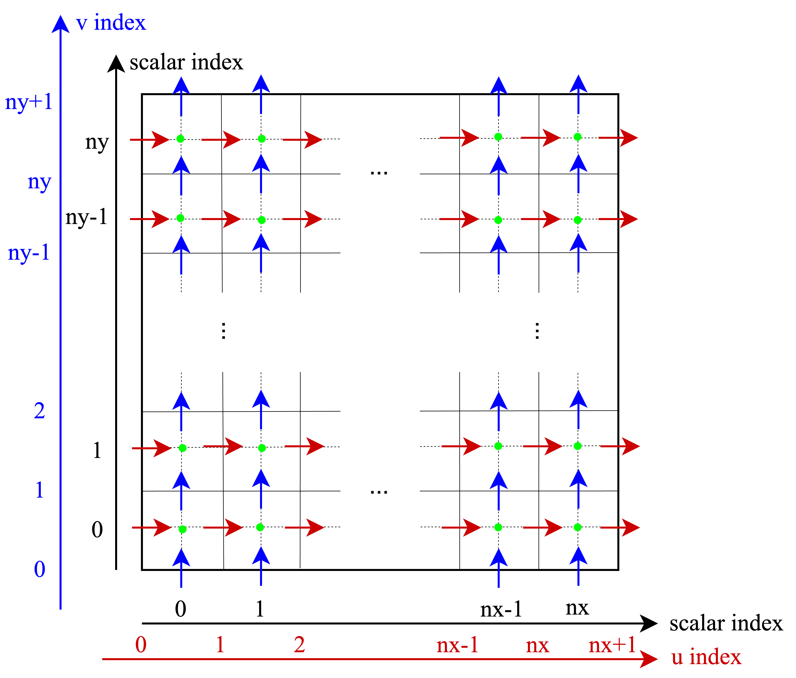

# スタガードグリッド

下図のように、スカラー点を囲むセル境界でベクトル場を定義する、スタガードグリッドを使用する。
左図は、領域全体での様子である。
右図は、部分的に切り取ったインデックスの振り方である。

    
    

文字の設定は以下の通りである。
| 文字 | 単位 | 意味 |
|-----|-----|------|
|lx   | m   | 横方向領域サイズ|
|ly   | m   | 縦方向領域サイズ|
|nx   | -   | 横方向分割数|
|ny    | -   | 縦方向分割数|

領域の内部をnx, ny個に分割し、前後左右にゴーストセルを一つずつ配置する。
c言語のインデックスが0から始まるので、図においてスカラーの最終インデックスがnx+1, ny+1となる。

スカラーグリッドをxs[i], ys[j], uグリッドをxu[i], vグリッドをyv[j]と表記する。
xs[0] = -0.5 * (lx / nx)なので、xs[i] = -0.5*(lx/nx) + (lx/nx)*i = (i - 0.5) * (lx / nx)で書ける。

同様にして、全て考えると、
| 座標 | 表現 | インデックス範囲と点数 |
|-----|-------|---------------|
| xs[i] | (i - 0.5)*(lx/nx)| [0, nx+1], (nx+2) |
| xs[j] | (j - 0.5)*(ly/ny)| [0, ny+1], (ny+2) |
| xu[i] | i * (lx/nx)| [0, nx], (nx+1) |
| yv[j] | j * (ly/ny)| [0, ny], (ny+1) |